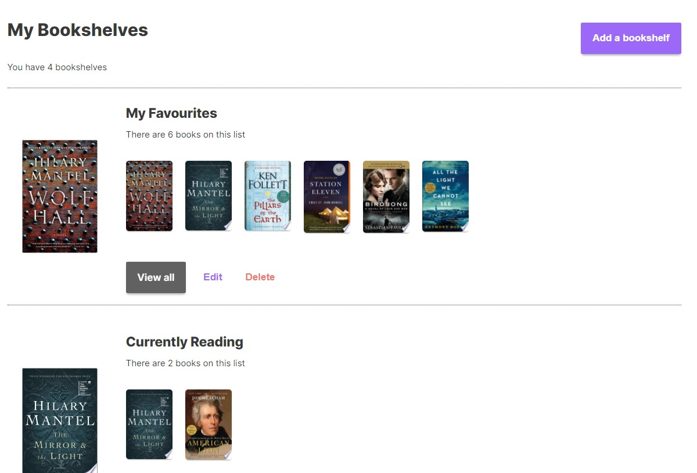

# Readingly

A reading tracker application using the Google Books API. It helps users meet their reading goals by providing personalized recommendations of how much time to invest in their book. It has a frontend built with NextJS, React, and Apollo, and a backend built with Apollo Server, Sequelize, and PostgreSQL.



## Project Status

This project is currently in development. Users can add books to bookshelves, update reading progress, create reading goals, and manage their accounts. Functionality for reading recommendations and personalized reading speed is in progress.

## Installation and setup

Clone this repo:

```bash
git clone https://github.com/gdgkirkley/readingly
```

To run the backend:

```bash
cd backend
npm install
npm start
```

```bash
cd frontend
npm install
npm run dev
```

To run the test suite:

```bash
npm test
```

Run with coverage:

```bash
npm run test:coverage
```

## Contributing

Want to contribute? Great! To fix a bug or enhance an existing module:

- Fork this repo
- Create a new branch `git checkout -b new-feature-name`
- Make your changes
- Commit your changes `git commit -m 'Improved feature'`
- Push to your branch `git push origin improve-feature-name`
- Create a pull request!

## Bugs or feature requests

If you find a bug, kindly open an issue here and include details of the issue you encountered.

If you'd like to request a new function, feel free to do so by opening an issue here. Please include details of how you imagine the feature working.

## Built With

- [NextJS](https://github.com/vercel/next.js), React framework for server-rendered websites
- [Apollo Client & Server](https://github.com/apollographql), a fully-featured GraphQL client and server.
- GraphQL
- [Sequelize](https://github.com/sequelize/sequelize), ORM for interacting with the database and performing migrations

## License

MIT © [Gabriel Kirkley](https://github.com/gdgkirkley)
